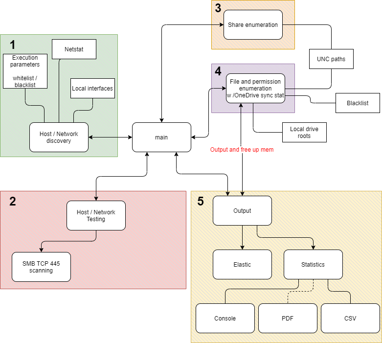

[](https://GitHub.com/punk-security/pwnspoof/graphs/commit-activity)
[](https://www.punksecurity.co.uk)
[](https://hub.docker.com/r/punksecurity/smbeagle)
[](https://sonarcloud.io/summary/new_code?id=punk-security_smbeagle)
[](https://sonarcloud.io/summary/new_code?id=punk-security_smbeagle)
[](https://sonarcloud.io/summary/new_code?id=punk-security_smbeagle)

```
    ____              __   _____                      _ __       
   / __ \__  ______  / /__/ ___/___  _______  _______(_) /___  __
  / /_/ / / / / __ \/ //_/\__ \/ _ \/ ___/ / / / ___/ / __/ / / /
 / ____/ /_/ / / / / ,<  ___/ /  __/ /__/ /_/ / /  / / /_/ /_/ / 
/_/    \__,_/_/ /_/_/|_|/____/\___/\___/\__,_/_/  /_/\__/\__, /  
                        PRESENTS                        /____/   
```                                                       
    
# SMBeagle

SMBeagle is a cross-platform (SMB) fileshare auditing tool that hunts out all files it can see in the network 
and reports if the file can be read and/or written.  All these findings are streamed out to either
a CSV file or an elasticsearch host, or both!?  🚀

When running on Windows, with no credentials provided, SMBeagle will make use of the win32 APIs for maximum speed, and integrated auth.

When running on Linux, or when credentials are provided, we use the cross-platform file scanning through [SMBLibrary](https://github.com/TalAloni/SMBLibrary)

## No more digital signing

SMBeagle up to v3 was digitally signed, but v4 adds more offensive features. Namely, it will now look for an retrieve juicy looking files. Great for pentests, but not something we want to digitally sign!

If you want the original version, without the file grabbing features, use v3 which is digitally signed.

It has 2 awesome use cases:

### Cast a spotlight on weak share permissions.
Businesses of all sizes often have file shares with awful file permissions.  

Large businesses have sprawling shares on file servers and its not uncommon to find sensitive data with misconfigured permissions. 

Small businesses often have a small NAS in the corner of the office with no restrictions at all!

SMBeagle crawls these shares and lists out all the files it can read and write.  If it can read them, so can ransomware. 
    
### Lateral movement and privilege escalation
SMBeagle can provide penetration testers with the less obvious routes to escalate privileges and move laterally.

By outputting directly into elasticsearch, testers can quickly find readable scripts and writeable executables.

Finding watering hole attacks and unprotected passwords never felt so easy! 🐱‍👤

**To make it even easier, we've added the ```-g``` flag which will now fetch files back if they look interesting!**

What looks interesting? Well by default we look for scripts and filenames with words like password in them.

... You can provide your own regexes with the ```--file-pattern``` flag.

## Kibana Dashboard
Please see [Kibana readme](Kibana/README.md) for detailed instructions on installing and using the Kibana dashboards which
provide management visuals and makes data pivoting all the easier.

## Installation

### Docker
* ```docker pull punksecurity/smbeagle```

### Linux
* Go to the latest release https://github.com/punk-security/smbeagle/releases/latest
* Download the linux_amd64.zip or linux_arm64.zip
* Unzip the download and run smbeagle from the terminal

### Windows
* Go to the latest release https://github.com/punk-security/smbeagle/releases/latest
* Download the win_x64.zip (only 64bit is supported at the moment)
* Unzip the download and run SMBeagle.exe from a command prompt or powershell terminal

## Usage

The only mandatory parameter is to set an output, which should be either an elasticsearch hosts IP address or a csv file.

A good starting point is to enable fast mode and output to csv, but this CSV could get huge depending on how many files it finds.

```
./SMBeagle.exe -c out.csv -f
```

### Public IP scanning

The scanning of discovered public hosts and networks is disabled by default as SMBeagle discovers networks from netstat which 
includes all current connections such as web browser sessions etc.

To scan a public network, declare it manually with something like `-n 1.0.0.1/32` or `-n 1.0.0.0/24`

### Docker usage
Punk security provides a linux docker image of SMBeagle.

To get findings out, you will need to mount a folder into the container and tell SMBeagle to save its output to that mount (or use elasticsearch)

A good starter example is:

`docker run -v "$(pwd)/output:/tmp/output" punksecurity/smbeagle -c /tmp/output/results.csv -n 10.10.10.0/24`

Note that network discovery is disabled when running in docker, so make sure you pass the ranges that
you wish to scan with the `-n` command line switch, or hosts will the `-h` switch.

### Full Usage

```
USAGE:
Output to a CSV file:
  SMBeagle -c out.csv
Output to elasticsearch (Preferred):
  SMBeagle -e 127.0.0.1
Output to elasticsearch and CSV:
  SMBeagle -c out.csv -e 127.0.0.1
Disable network discovery and provide manual networks:
  SMBeagle -D -e 127.0.0.1 -n 192.168.12.0./23 192.168.15.0/24
Do not enumerate ACLs (FASTER):
  SMBeagle -A -e 127.0.0.1

  -c, --csv-file                     (Group: output) Output results to a CSV
                                     file by providing filepath
  -e, --elasticsearch-host           (Group: output) Output results to
                                     elasticsearch by providing elasticsearch
                                     hostname (default port is 9200 , but can be
                                     overridden)
  --elasticsearch-port               (Default: 9200) Define the elasticsearch
                                     custom port if required
  -f, --fast                         Enumerate only one files permissions per
                                     directory
  -l, --scan-local-shares            Scan the local shares on this machine
  -D, --disable-network-discovery    Disable network discovery
  -n, --network                      Manually add network to scan (multiple
                                     accepted)
  -N, --exclude-network              Exclude a network from scanning (multiple
                                     accepted)
  -h, --host                         Manually add host to scan
  -H, --exclude-host                 Exclude a host from scanning
  -q, --quiet                        Disable unneccessary output
  -S, --exclude-share                Do not scan shares with this name (multiple
                                     accepted)
  -s, --share                        Only scan shares with this name (multiple
                                     accepted)
  --file-pattern                     Only fetch files matching these regexes
                                     patterns
  -g, --grab-files                   Grab files and store them locally
  --loot                             (Default: loot) Path to store grabbed files
  -E, --exclude-hidden-shares        Exclude shares ending in $
  -v, --verbose                      Give more output
  -m, --max-network-cidr-size        (Default: 20) Maximum network size to scan
                                     for SMB Hosts
  -A, --dont-enumerate-acls          (Default: false) Skip enumeration of file
                                     ACLs
  -d, --domain                       (Default: ) Domain for connecting to SMB
  -u, --username                     Username for connecting to SMB - mandatory
                                     on linux
  -p, --password                     Password for connecting to SMB - mandatory
                                     on linux
  --help                             Display this help screen.
  --version                          Display version information.

```

## Architecture

SMBeagle does a lot of work, which is broken down into loosely coupled modules which hand off to each other.
This keeps the design simple and allows us to extend each module easily.

In summary it:

* Looks at your local machine for network connections and adapters
* Takes all those private adaptors and connections and builds a list of private network candidates
* Scans those networks for TCP port 445
* Scans all detected SMB servers for accessible shares
* Inventories all those shares for files and checks Read, Write, Delete permissions


